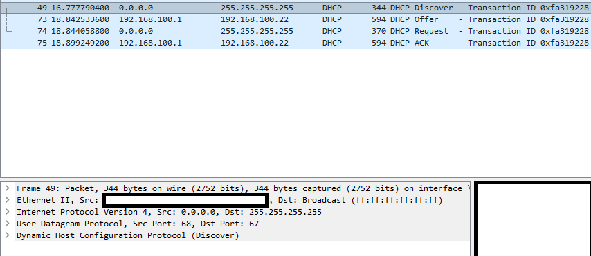
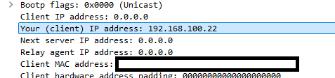
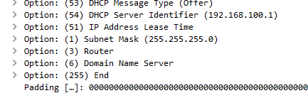
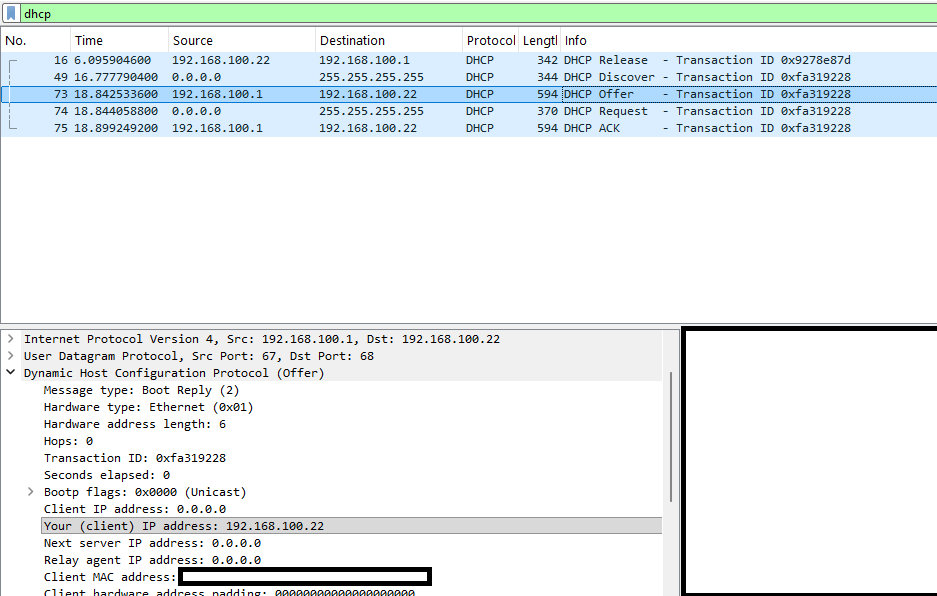
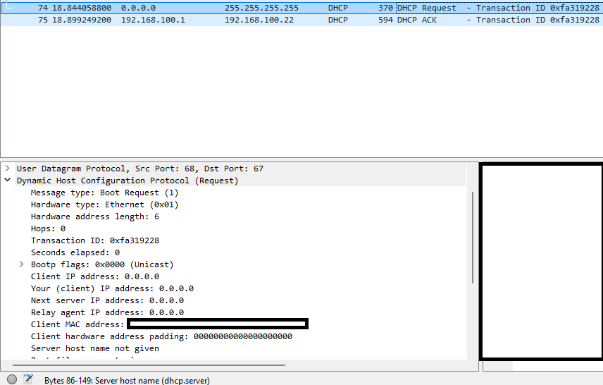
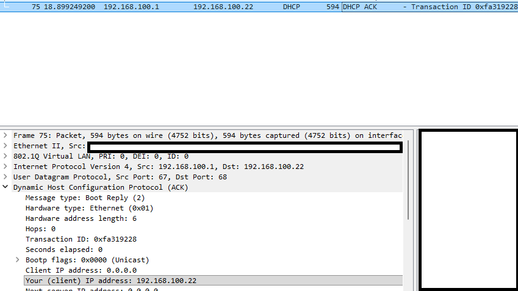

# DHCP DORA Process Analysis

Packet-level analysis of the DHCP DORA exchange captured with Wireshark.

**Tools:** Wireshark · Windows (ipconfig)  
**Topic:** CompTIA Network+ N10-009 — 3.4 DHCP

---

On IPv4, a device uses DHCP to be assigned a network configuration such as IP address, subnet mask, VoIP server, DNS server, and router gateway. DHCP defines 256 options (254 usable).

To analyze the DORA process, I forced a new lease (`ipconfig /release && ipconfig /renew`) and captured the exchange with Wireshark.

> All four packets share the same Transaction ID (`0xfa319228`), which is how the client and server correlate the exchange.

## Step 1 — Discover

My device sends a broadcast from `0.0.0.0:68` to `255.255.255.255:67` to discover a DHCP server that can provide an IPv4 configuration.

The client includes its own MAC address inside the Discover message (the `chaddr` field), which is how the server later knows where to send the reply.

DHCP options carried in the offer:

## Step 2 — Offer

Because the server already learned my MAC address from the Discover frame, it sent the offer directly to my device.

The offer arrived as a unicast because the Discover frame had the broadcast flag set to 0, telling the server to reply using my MAC address. If the flag had been set to 1, the server would have replied as a broadcast.

## Step 3 — Request

The client sends a broadcast to accept the offer. It is broadcast (rather than unicast) so that any other DHCP servers that also made an offer know their offer was rejected and can release the reserved IP back to their pool.

## Step 4 — Acknowledge

Finally, the server sends the acknowledgment confirming the IP address is now leased to my device.

## SOC Relevance

1. **Rogue DHCP server:** An attacker sets up a malicious DHCP server that assigns malicious DHCP options, such as a rogue DNS server or gateway, to perform a man-in-the-middle attack.
2. **MAC–IP attribution:** IPs are leased and change over time with dynamic assignment, so an IP alone doesn't identify a device. To investigate an event, we cross the DHCP logs with the IP and timestamp to find which MAC address — and therefore which physical device — held that IP at that exact moment.
